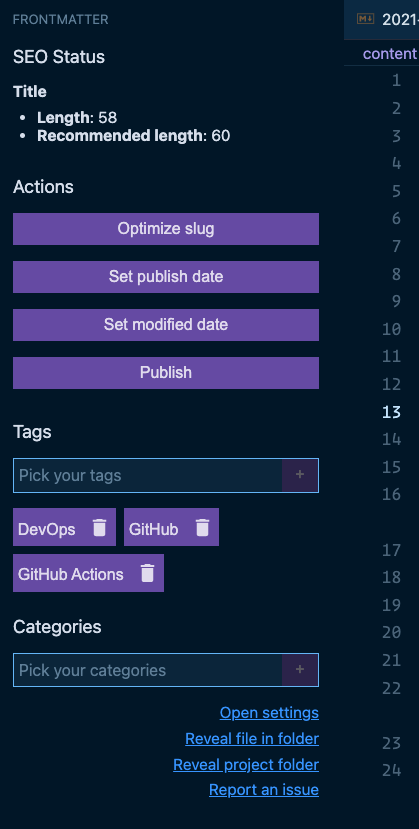
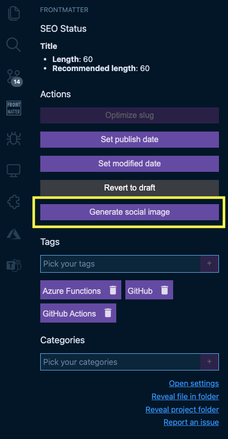

[](https://marketplace.visualstudio.com/items?itemName=eliostruyf.vscode-front-matter)
&nbsp;&nbsp;
[](https://marketplace.visualstudio.com/items?itemName=eliostruyf.vscode-front-matter)
&nbsp;&nbsp;
[](https://marketplace.visualstudio.com/items?itemName=eliostruyf.vscode-front-matter&ssr=false#review-details)

This VSCode extension simplifies working with your markdown articles' front matter when using a static site generator like Hugo, Jekyll, Hexo, NextJs, Gatsby, and many more... For example, you can keep a list of used tags, categories and add/remove them from your article with the extension.

The extension will automatically verify if your title and description are SEO compliant. If this would not be the case, it will give you a warning.

> If you see something missing in your article creation flow, please feel free to reach out.

## FrontMatter Panel (introduced in 1.10.0)

In version `1.10.0` of this extension, the FrontMatter panel got introduced. This panel allows you to perform most of the extension actions by just a click on the button. 



Initially, this panel has been created to make it easier to add tags and categories to your articles as the current VSCode multi-select is not optimal to use.

To leverage most of the capabilities of the extension. SEO information and everyday actions like slug optimization, updating the date, and publish/drafting the article.

> **Info**: By default, the tags/categories picker allows you to insert existing and none tags/categories. When you enter a none existing tag/category, the panel shows an add `+` icon in front of that button. This functionality allows you to store this tag/category in your settings. If you want to disable this feature, you can do that by setting the `frontMatter.panel.freeform` setting to `false`.

Since version `1.15.0`, the extension allows you to create your own custom actions, by running Node.js scripts from your project. In order to use this functionality, you will need to configure the [`frontMatter.custom.scripts`](#frontMatter.custom.scripts) setting for your project.

Once a custom action has been configured, it will appear on the Front Matter panel.



The current workspace-, file-path, and front matter data will be passed as an argument. In your script fetch these arguments as follows:

```javascript
const arguments = process.argv;
const workspaceArg = arguments[2];
const fileArg = arguments[3];
const dataArg = arguments[4];
const data = dataArg && typeof dataArg === "string" ? JSON.parse(dataArg) : null;
```

The output of the script will be passed as a notification, and it allows you to copy the output.


## Creating articles from templates

By default, the extension looks for files stored in a `.templates` folder that should be located in your website project's root.

> **Info**: You can overwrite the path by specifying it with the `frontMatter.templates.folder` setting.

When adding files in the folder, you'll be able to run the `Front Matter: New article from template` from a command or explorer menu. It will present you with the article template options once you pick one and specify the title. It creates the file and updates its front matter.

> **Info**: By default, the extension will create articles with a `yyyy-MM-dd` prefix. If you do not want that or change the date format, you can update the `frontMatter.templates.prefix` setting.

## Syntax highlighting for Hugo Shortcodes


## Available commands:

**Front Matter: Create <tag | category>**

Creates a new <tag | category> and allows you to include it into your post automatically


  
**Front Matter: Insert <tags | categories>**

Inserts a selected <tags | categories> into the front matter of your article/post/... - When using this command, the FrontMatter panel opens and focuses on the specified type.

> **Info**: This experience changed in version `1.11.0`.

**Front Matter: Export all tags & categories to your settings**

Export all the already used tags & categories in your articles/posts/... to your user settings.

**Front Matter: Remap or remove tag/category in all articles**

This command helps you quickly update/remap or delete a tag or category in your markdown files. The extension will ask you to select the taxonomy type (*tag* or *category*), the old taxonomy value, and the new one (leave the input field *blank* to remove the tag/category). 

> **Info**: Once the remapping/deleting process completes. Your VSCode settings update with all new taxonomy tags/categories.

**Front Matter: Set current date**

Update the `date` property of the current article/post/... to the current date & time.

**Optional**: if you want, you can specify the date property format by adding your settings' preference. Settings key: `frontMatter.taxonomy.dateFormat`. Check [date-fns formatting](https://date-fns.org/v2.0.1/docs/format) for more information on which patterns you can use.

**Front Matter: Set lastmod date**

Update the `lastmod` (last modified) property of the current article/post/... to the current date & time.

> **note**: Uses the same date format settings key as current date: `frontMatter.taxonomy.dateFormat`.

**Front Matter: Generate slug based on article title**

This command generates a clean slug for your article. It removes known stop words, punctuations, and special characters. 

Example:
```
title: Just a sample page with a title
slug: sample-page-title
```

You can also specify a prefix and suffix, which can be added to the slug if you want. Use the following settings to do this: `frontMatter.taxonomy.slugPrefix` and `frontMatter.taxonomy.slugSuffix`. By default, both options are not provided and will not add anything to the slug.

> **Info**: At the moment, the extension only supports English stopwords.

## Where is the data stored?

The tags and categories are stored in the project VSCode user settings. You can find them back under: `.vscode/settings.json`.

```json
{
  "frontMatter.taxonomy.tags": [],
  "frontMatter.taxonomy.categories": []
}
```

## Additional extension settings

The extension has more settings that allow you to configure it to your needs further. Here is a list of settings that you can set:

### `frontMatter.taxonomy.seoTitleLength`

Specifies the optimal title length for SEO (set to `-1` to turn it off). Default value: `60`.

```json
{
  "frontMatter.taxonomy.seoTitleLength": 60
}
```
### `frontMatter.taxonomy.seoDescriptionLength`

Specifies the optimal description length for SEO (set to `-1` to turn it off). Default value: `160`.

```json
{
  "frontMatter.taxonomy.seoDescriptionLength": 160
}
```
### `frontMatter.taxonomy.seoDescriptionLength`

Specifies the name of the SEO description field for your page. Default is `description`.

```json
{
  "frontMatter.taxonomy.seoDescriptionField": "description"
}
```

### `frontMatter.taxonomy.frontMatterType`

Specify which Front Matter language you want to use. The extension supports `YAML` (default) and `TOML`.

```json
{
  "frontMatter.taxonomy.frontMatterType": "YAML"
}
```

### `frontMatter.taxonomy.indentArrays`

Specify if arrays in the front matter are indented. Default: `true`. If you do not want to indent the array values, you can update it with the following setting change:

```json
{
  "frontMatter.taxonomy.indentArrays": false
}
```

### `frontMatter.taxonomy.noPropertyValueQuotes`

Specify the property names of which you want to remove the quotes in the output value. **Warning**: only use this when you know what you are doing. If you're going to, for instance, remove the quotes from the date property, you can add the following:

```json
{
  "frontMatter.taxonomy.noPropertyValueQuotes": ["date"]
}
```

### `frontMatter.taxonomy.dateField`

Specifies the date field name to use in your Front Matter. Default value: `date`.

```json
{
  "frontMatter.taxonomy.dateField": "date"
}
```

### `frontMatter.taxonomy.modifiedField`

Specifies the modified date field name to use in your Front Matter. Default value: `lastmod`.

```json
{
  "frontMatter.taxonomy.modifiedField": "lastmod"
}
```

### `frontMatter.custom.scripts`

Allows you to specify a title and script path (starting relative from the root of your project). These values will be used to create custom actions on the Front Matter panel. Default value: `[]`.

```json
{
  "frontMatter.custom.scripts": [{
    "title": "Generate social image",
    "script": "./scripts/social-img.js",
    "nodeBin": "~/.nvm/versions/node/v14.15.5/bin/node"
  }]
}
```

> **Important**: When the command execution would fail when it cannot find the `node` command. You are able to specify your path to the node app. This is for instance required when using `nvm`.

## Usage

- Start by opening the command prompt:
  - Windows: ⇧+ctrl+P
  - Mac: ⇧+⌘+P
- Use one of the commands from above

## Feedback / issues / ideas

Please submit them via creating an issue in the project repository: [issue list](https://github.com/estruyf/vscode-front-matter/issues).
