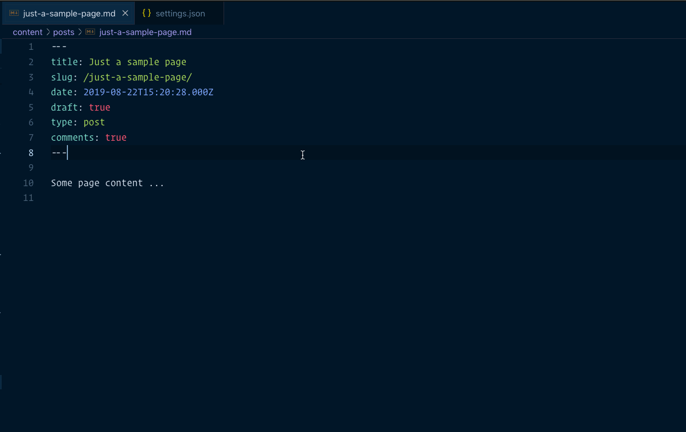

[](https://marketplace.visualstudio.com/items?itemName=eliostruyf.vscode-front-matter)
&nbsp;&nbsp;
[](https://marketplace.visualstudio.com/items?itemName=eliostruyf.vscode-front-matter)
&nbsp;&nbsp;
[](https://marketplace.visualstudio.com/items?itemName=eliostruyf.vscode-front-matter&ssr=false#review-details)

This VSCode extension simplifies working with front matter of your markdown articles when using a static site generator like Hugo, Jekyll, Hexo, NextJs, Gatsby, and many more... For example, with the extension, you can keep a list of used tags, categories and add/remove them from your article.

The extension will automatically verify if your title and description are SEO compliant. If this would not be the case, it will give you a warning.

> If you see something missing in your article creation flow, please feel free to reach out.

## Syntax highlighting for Hugo Shortcodes


## Available commands:

**Front Matter: Create <tag | category>**

Creates a new <tag | category> and allows you to include it into your post automatically


  
**Front Matter: Insert <tags | categories>**

Inserts a selected <tags | categories> into the front matter of your article/post/...



**Front Matter: Export all tags & categories to your settings**

Export all the already used tags & categories in your articles/posts/... to your user settings

**Front Matter: Remap or remove tag/category in all articles**

This command helps you quickly update/remap or delete a tag or category in your markdown files. The extension will ask you to select the taxonomy type (*tag* or *category*), the old taxonomy value, and the new one (leave the input field *blank* to remove the tag/category). 

> **Info**: Once the remapping/deleting process is completed. The user settings will be updated with all new taxonomy tags/categories.

**Front Matter: Set current date**

Update the `date` property of the current article/post/... to the current date & time.

**Optional**: if you want, you can specify the date property format by adding your preference in your settings. Settings key: `frontMatter.taxonomy.dateFormat`. Check [date-fns formatting](https://date-fns.org/v2.0.1/docs/format) for more information on which patterns you can use.

**Front Matter: Set lastmod date**

Update the `lastmod` (last modified) property of the current article/post/... to the current date & time.

> **note**: Uses the same date format settings key as current date: `frontMatter.taxonomy.dateFormat`.

**Front Matter: Generate slug based on article title**

This command generates a clean slug for your article. It removes known stop words, punctuations, and special characters. 

Example:
```
title: Just a sample page with a title
slug: sample-page-title
```

You can also specify a prefix and suffix, which can be added to the slug if you want. Use the following settings to do this: `frontMatter.taxonomy.slugPrefix` and `frontMatter.taxonomy.slugSuffix`. By default, both options are not provided and will not add anything to the slug.

> **Info**: At the moment, only English stop words are supported.

## Where is the data stored?

The tags and categories are stored in the project VSCode user settings. You can find them back under: `.vscode/settings.json`.

```json
{
  "frontMatter.taxonomy.tags": [],
  "frontMatter.taxonomy.categories": []
}
```

## Additional extension settings

The extension has more settings that allow you to configure it to your needs further. Here is a list of settings which you can set:

- `frontMatter.taxonomy.frontMatterType`
  - Specify which Front Matter language you want to use. The extension supports `YAML` (default) and `TOML`.

```json
{
  "frontMatter.taxonomy.frontMatterType": "YAML"
}
```

- `frontMatter.taxonomy.indentArrays`
  - Specify if arrays in the front matter are indented. Default: `true`. If you do not want to indent the array values, you can update it with the following setting change:

```json
{
  "frontMatter.taxonomy.indentArrays": false
}
```

- `frontMatter.taxonomy.noPropertyValueQuotes`
  - Specify the property names of which you want to remove the quotes in the output value. **Warning**: only use this when you know what you are doing. If you want to, for instance, remove the quotes from the date property, you can add the following:

```json
{
  "frontMatter.taxonomy.noPropertyValueQuotes": ["date"]
}
```

## Usage

- Start by opening the command prompt:
  - Windows: ⇧+ctrl+P
  - Mac: ⇧+⌘+P
- Use one of the commands from above

## Feedback / issues / ideas

Please submit them via creating an issue in the project repository: [issue list](https://github.com/estruyf/vscode-front-matter/issues).
