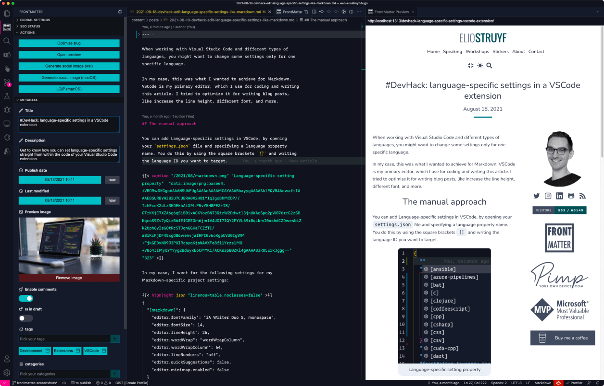

<h1 align="center">
  
</h1>

<h2 align="center">Front Matter is an essential Visual Studio Code extension when you want to manage the markdown pages of your static sites.</h2>

  

  
  
  

  

<h2 align="center">
  <a href="https://frontmatter.codes" title="Documentation @ frontmatter.codes">
    Check out the extension documentation at frontmatter.codes
  </a>
</h2>

Front Matter is an essential Visual Studio Code extension that simplifies working and managing your markdown articles. We created the extension to support many static-site generators like Hugo, Jekyll, Hexo, NextJs, Gatsby, and more. 

The extension brings Content Management System (CMS) capabilities straight within Visual Studio Code. For example, you can keep a list of the used tags, categories, create content, and so much more.

Our main extension features are:

- Page dashboard where you can get an overview of all your markdown pages. You can use it to search, filter, sort your contents.
- Site preview within Visual Studio Code
- SEO checks for title, description, and keywords
- Support for custom actions/scripts
- and many more

  

> If you see something missing in your article creation flow, please feel free to reach out.

**Version 4**

Support for Team level settings, content-types, and image support. Get to know more at: [v4.0.0 release notes](https://frontmatter.codes/updates/v4_0_0).

**Version 3**

In version v3 we introduced the welcome and dashboard webview. The welcome view allows to get you started using the extension, and the dashboard allows you to manage all your markdown pages in one place. This makes it easy to search, filter, sort, and more.

**Version 2**

In version v2 we released the re-designed sidebar panel with improved SEO support. This extension makes it the only extension to manage your Markdown pages for your static sites in Visual Studio Code.

  

<h2 align="center">
  <a href="https://frontmatter.codes" title="Documentation @ frontmatter.codes">
    Check out the extension documentation at frontmatter.codes
  </a>
</h2>

## 👉 Contributors 🤘

 
 

## 🖤 Sponsors

  

 
 

  

