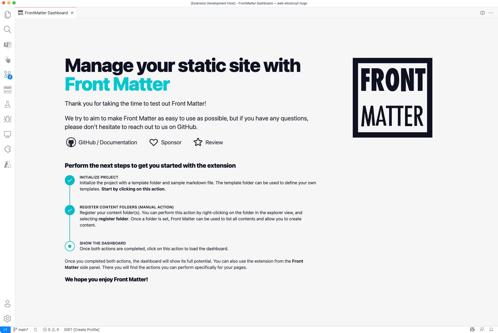
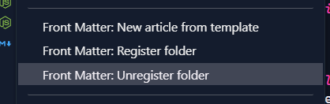
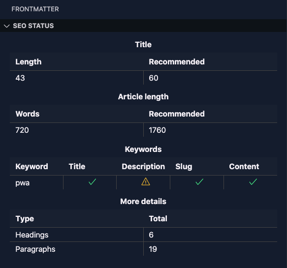
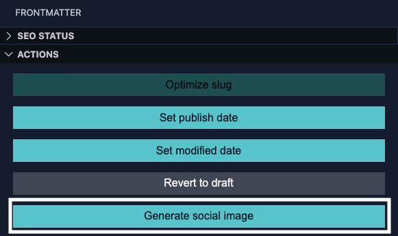
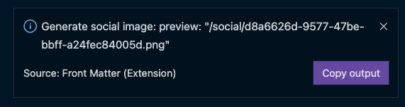
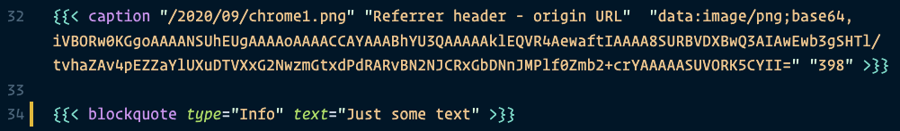
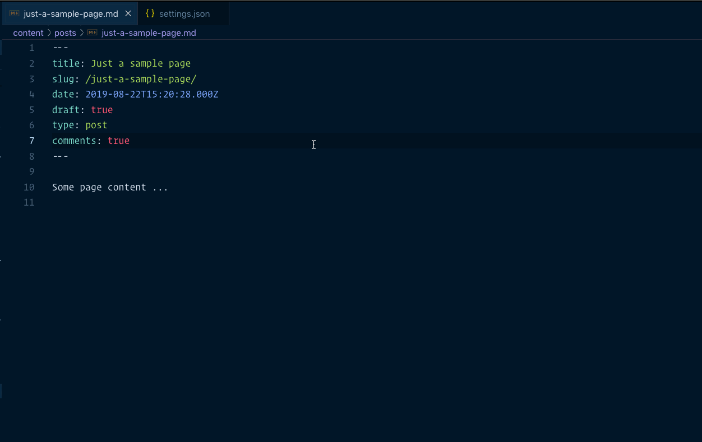

<h1 align="center">
  <a href="https://marketplace.visualstudio.com/items?itemName=eliostruyf.vscode-front-matter">
    
  </a>
</h1>

<h2 align="center">Front Matter is an essential Visual Studio Code extension when you want to manage the markdown pages of your static sites.</h2>

<p align="center">
  <a href="https://marketplace.visualstudio.com/items?itemName=eliostruyf.vscode-front-matter" title="Check it out on the Visual Studio Marketplace">
    
  </a>

  
  
  

  <a href="https://www.buymeacoffee.com/zMeFRy9" title="Buy me a coffee" style="margin-left:10px">
    
  </a>
</p>

<p align="center">
  
</p>

Front Matter is an essential Visual Studio Code extension that simplifies working and managing your markdown articles. We created the extension to support many static-site generators like Hugo, Jekyll, Hexo, NextJs, Gatsby, and more. 

The extension brings Content Management System (CMS) capabilities straight within Visual Studio Code. For example, you can keep a list of the used tags, categories, create content, and so much more.

Our main extension features are:

- Page dashboard where you can get an overview of all your markdown pages. You can use it to search, filter, sort your contents.
- Site preview within Visual Studio Code
- SEO checks for title, description, and keywords
- Support for custom actions/scripts
- and many more

<p align="center">
  
</p>

> If you see something missing in your article creation flow, please feel free to reach out.

**Version 3**

In version v3 we introduced the welcome and dashboard webview. The welcome view allows to get you started using the extension, and the dashboard allows you to manage all your markdown pages in one place. This makes it easy to search, filter, sort, and more.

**Version 2**

In version v2 we released the re-designed sidebar panel with improved SEO support. This extension makes it the only extension to manage your Markdown pages for your static sites in Visual Studio Code.

<p align="center" style="margin-top: 2rem;">
  <a href="https://www.producthunt.com/posts/front-matter?utm_source=badge-featured&utm_medium=badge&utm_souce=badge-front-matter" target="_blank">
    
  </a>
</p>

<h2 id="table-of-contents">Table of Contents</h2>

<details open="open">
  <summary>Table of Contents</summary>
  <ol>
    <li><a href="#welcome-view">Welcome view</a></li>
    <li><a href="#markdown-features">Markdown features</a></li>
    <li><a href="#dashboard">Dashboard</a></li>
    <li><a href="#the-panel">The panel</a></li>
    <li><a href="#site-preview">Site preview</a></li>
    <li><a href="#custom-actions">Custom actions/scripts</a></li>
    <li><a href="#creating-articles-from-templates">Create articles from templates</a></li>
    <li><a href="#syntax-highlighting-for-hugo-shortcodes">Syntax highlighting for Hugo Shortcodes</a></li>
    <li><a href="#available-commands">Available commands</a></li>
    <li><a href="#extension-settings">Extension settings</a></li>
    <li><a href="#feedback--issues--ideas">Feedback / issues / ideas</a></li>
  </ol>
</details>

## Welcome view

The first time you open the dashboard, or when you did not initialize the Front Matter extension yet, the welcome view will get shown.

<p align="center">
  
</p>

It also supports light themes:

<p align="center">
  
</p>

## Markdown features

The Front Matter extension tries to make it easy to manage your Markdown pages/content. Within a Markdown page, we allow you to fold the file's Front Matter to be less distracting when writing. Also, do we highlight the Front Matter content to create a visual difference between content and metadata.

### Front Matter folding

<p align="center">
  
</p>

### Front Matter highlighting

<p align="center">
  
</p>

> **Info**: If you do not want this feature, you can disable it in the extension settings -> `Highlight Front Matter` or by setting the `frontMatter.content.fmHighlight` setting to `false`.

## Dashboard

Managing your Markdown pages has never been easier in VS Code. With the Front Matter dashboard, you will be able to view all your pages and search through them, filter, sort, and much more.

<p align="center">
  
</p>

In order to start using the dashboard, you will have to let the extension know in which folder(s) it can find your pages. A content folder can be registered or unregistered, by right-clicking on the folder in your VSCode explorer panel and clicking on the `Register folder` or `Unregister folder` menu item.

<p align="center">
  
</p>

> **Info**: If you want, you can click on the `Open on startup?` checkbox. This setting will allow the dashboard to automatically open when you launch the project in VS Code. It will only apply to the current project, not for all of them.

> **Details**: If your preview images aren't loaded, it might be that you need to configure the `publicFolder` where the extension can find them. For instance, in Hugo this is the `static` folder. You can configure this by updating the `frontMatter.content.publicFolder` setting.

## The panel

The Front Matter panel allows you to perform most of the extension actions by just a click on the button and it shows the SEO statuses of your title, description, and more.

Initially, this panel has been created to make it easier to add tags and categories to your articles as the current VSCode multi-select is not optimal to use.

To leverage most of the capabilities of the extension. SEO information and everyday actions like slug optimization, updating the date, and publish/drafting the article.

When you open the panel and the current file is not a Markdown file, it will contain the following sections:

<p align="center">
  
</p>

> **Info**: both **Global Settings** and **Other Actions** sections are shown for the base view as when a Markdown file is openend.

When you open the Front Matter panel on a Markdown file, you get to see the following sections:

**Global Settings**

<p align="center">
  
</p>

**SEO Status**

<p align="center">
  
</p>

**Actions**

<p align="center">
  
</p>

> **Info**: To gain the `open preview` button to show up, you will need to first set the `local preview URL`. You can do this within the `Global Settings` section or by updating the `frontMatter.preview.host` setting.

**Metadata**

<p align="center">
  
</p>

> **Info**: By default, the tags/categories picker allows you to insert existing and none tags/categories. When you enter a none existing tag/category, the panel shows an add `+` icon in front of that button. This functionality allows you to store this tag/category in your settings. If you want to disable this feature, you can do that by setting the `frontMatter.panel.freeform` setting to `false`.

**Recently Modified**

<p align="center">
  
</p>

Navigate quickly to a recently modified file. In the section, the latest 10 modified files get shown. In order to use this functionality, a registered content folder needs to be present. Check [Front Matter: New article from template](#front-matter-new-article-from-template) for more information about how you can register your content folders.

**Other actions**

<p align="center">
  
</p>

**Info**: The `Enable write settings` action allow you to make Markdown specific changes to optimize the writing of your articles. It will change settings like the `fontSize`, `lineHeight`, `wordWrap`, `lineNumbers` and more.

## Site preview

The Markdown preview is not consistently delivering the same result as the one you will see on your site. The Front Matter extension provides you a way to show the site result. For this, you will first have to set the `frontMatter.preview.host` setting. You can perform it from the `Global Settings` section in the panel or in your `settings.json` file to set the setting.

For example, with Hugo, the local server spins up on `http://localhost:1313`. When you set this URL as the value of the `frontMatter.preview.host` setting. You can click on the `open preview` button and the site preview will be shown.

<p align="center">
  
</p>

> **Important**: Be sure to spin up your local server. This is an action the extension currently doesn't do for you. If you want, you create yourself a custom action in order to start it.

## Custom actions

Since version `1.15.0`, the extension allows you to create your own custom actions, by running Node.js scripts from your project. In order to use this functionality, you will need to configure the [`frontMatter.custom.scripts`](#frontmattercustomscripts) setting for your project.

Once a custom action has been configured, it will appear on the Front Matter panel.

<p align="center">
  
</p>

The current workspace-, file-path, and front matter data will be passed as an argument. In your script fetch these arguments as follows:

```javascript
const arguments = process.argv;

if (arguments && arguments.length > 0) {
  const workspaceArg = arguments[2]; // The workspace path
  const fileArg = arguments[3]; // The file path
  const frontMatterArg = arguments[4]; // Front matter data

  console.log(`The content returned for your notification.`);
}
```

> A sample file can be found here: [script-sample.js](./sample/script-sample.js)

The output of the script will be passed as a notification, and it allows you to copy the output.

<p align="center">
  
</p>

## Creating articles from templates

By default, the extension looks for files stored in a `.templates` folder that should be located in your website project's root.

> **Info**: You can overwrite the path by specifying it with the `frontMatter.templates.folder` setting.

When adding files in the folder, you'll be able to run the `Front Matter: New article from template` from a command or explorer menu. It will present you with the article template options once you pick one and specify the title. It creates the file and updates its front matter.

> **Info**: By default, the extension will create articles with a `yyyy-MM-dd` prefix. If you do not want that or change the date format, you can update the `frontMatter.templates.prefix` setting.

## Syntax highlighting for Hugo Shortcodes

<p align="center">
  
</p>

## Available commands

### Front Matter: Initialize project

This command will initialize the project with a template folder and an article template. It makes it easier to get you started with the extension and creating your content.

### Front Matter: Create a template from current file

This command allows you to create a new template from the current open Markdown file. It will ask you for the name of the template and if you want to keep the current file its content in the template.

> **Info**: The create as template action is also available from the `other actions` section in the Front Matter panel.

### Front Matter: New article from template

With this command, you can easily create content in your project within the registered folders and provided templates.

You can register and unregister folders by right-clicking on the folder in your VSCode explorer panel.

<p align="center">
  
</p>

Once you registered a folder and a template has been defined ([how to create a template](#creating-articles-from-templates)), you can make use of this command. 

> **Info**: The benefit of this command is that you do not need to search the folder in which you want to create a new article/page/... The extension will do it automatically for you.

### Front Matter: Create <tag | category>

Creates a new <tag | category> and allows you to include it into your post automatically

<p align="center">
  
</p>
  
### Front Matter: Insert <tags | categories>

Inserts a selected <tags | categories> into the front matter of your article/post/... - When using this command, the Front Matter panel opens and focuses on the specified type.

> **Info**: This experience changed in version `1.11.0`.

### Front Matter: Export all tags & categories to your settings

Export all the already used tags & categories in your articles/posts/... to your user settings.

### Front Matter: Remap or remove tag/category in all articles

This command helps you quickly update/remap or delete a tag or category in your markdown files. The extension will ask you to select the taxonomy type (*tag* or *category*), the old taxonomy value, and the new one (leave the input field *blank* to remove the tag/category). 

> **Info**: Once the remapping/deleting process completes. Your VSCode settings update with all new taxonomy tags/categories.

### Front Matter: Set current date

Update the `date` property of the current article/post/... to the current date & time.

> **Optional**: if you want, you can specify the date property format by adding your settings' preference. Settings key: `frontMatter.taxonomy.dateFormat`. Check [date-fns formatting](https://date-fns.org/v2.0.1/docs/format) for more information on which patterns you can use.

### Front Matter: Set lastmod date

Update the `lastmod` (last modified) property of the current article/post/... to the current date & time. By setting the `frontMatter.content.autoUpdateDate` setting, it can be done automatically when performing changes to your markdown files.

> **note**: Uses the same date format settings key as current date: `frontMatter.taxonomy.dateFormat`.

### Front Matter: Generate slug based on article title

This command generates a clean slug for your article. It removes known stop words, punctuations, and special characters. 

Example:

```
title: Just a sample page with a title
slug: sample-page-title
```

You can also specify a prefix and suffix, which can be added to the slug if you want. Use the following settings to do this: `frontMatter.taxonomy.slugPrefix` and `frontMatter.taxonomy.slugSuffix`. By default, both options are not provided and will not add anything to the slug. Another setting is to allow you to sync the filename with the generated slug. The setting you need to turn on enable for this is `frontMatter.taxonomy.alignFilename`.

> **Info**: At the moment, the extension only supports English stopwords.

### Front Matter: Preview article

Opens the site preview for the current article. More information about it can be found in the [site preview](#site-preview) section.

### Usage

- Start by opening the command prompt:
  - Windows: ⇧+ctrl+P
  - Mac: ⇧+⌘+P
- Use one of the commands from above

## Where is the data stored?

The tags and categories are stored in the project VSCode user settings. You can find them back under: `.vscode/settings.json`.

```json
{
  "frontMatter.taxonomy.tags": [],
  "frontMatter.taxonomy.categories": []
}
```

## Extension settings

The extension has more settings that allow you to configure it to your needs further. Here is a list of settings that you can set:

### `frontMatter.taxonomy.seoTitleLength`

Specifies the optimal title length for SEO (set to `-1` to turn it off). Default value: `60`.

```json
{
  "frontMatter.taxonomy.seoTitleLength": 60
}
```
### `frontMatter.taxonomy.seoDescriptionLength`

Specifies the optimal description length for SEO (set to `-1` to turn it off). Default value: `160`.

```json
{
  "frontMatter.taxonomy.seoDescriptionLength": 160
}
```

### `frontMatter.taxonomy.seoContentLength`

Specifies the optimal minimum length for your articles. Between 1,760 words – 2,400 is the absolute ideal article length for SEO in 2021. (set to `-1` to turn it off).

```json
{
  "frontMatter.taxonomy.seoContentLength": 1760
}
```

### `frontMatter.taxonomy.seoDescriptionLength`

Specifies the name of the SEO description field for your page. Default is `description`.

```json
{
  "frontMatter.taxonomy.seoDescriptionField": "description"
}
```

### `frontMatter.taxonomy.frontMatterType`

Specify which Front Matter language you want to use. The extension supports `YAML` (default) and `TOML`.

```json
{
  "frontMatter.taxonomy.frontMatterType": "YAML"
}
```

### `frontMatter.taxonomy.indentArrays`

Specify if arrays in the front matter are indented. Default: `true`. If you do not want to indent the array values, you can update it with the following setting change:

```json
{
  "frontMatter.taxonomy.indentArrays": false
}
```

### `frontMatter.taxonomy.noPropertyValueQuotes`

Specify the property names of which you want to remove the quotes in the output value. **Warning**: only use this when you know what you are doing. If you're going to, for instance, remove the quotes from the date property, you can add the following:

```json
{
  "frontMatter.taxonomy.noPropertyValueQuotes": ["date"]
}
```

### `frontMatter.taxonomy.dateField`

Specifies the date field name to use in your Front Matter. Default value: `date`.

```json
{
  "frontMatter.taxonomy.dateField": "date"
}
```

### `frontMatter.taxonomy.modifiedField`

Specifies the modified date field name to use in your Front Matter. Default value: `lastmod`.

```json
{
  "frontMatter.taxonomy.modifiedField": "lastmod"
}
```

### `frontMatter.custom.scripts`

Allows you to specify a title and script path (starting relative from the root of your project). These values will be used to create custom actions on the Front Matter panel. Default value: `[]`.

```json
{
  "frontMatter.custom.scripts": [{
    "title": "Generate social image",
    "script": "./scripts/social-img.js",
    "nodeBin": "~/.nvm/versions/node/v14.15.5/bin/node"
  }]
}
```

> **Important**: When the command execution would fail when it cannot find the `node` command. You are able to specify your path to the node app. This is for instance required when using `nvm`.

### `frontMatter.content.folders`

This array of folders defines where the extension can easily create new content by running the create article command.

```json
{
  "frontMatter.content.folders": [{
    "title": "Articles",
    "fsPath": "<the path to the folder>",
    "paths": ["<wsl-folder-path>"]
  }]
}
```

> **Important**: This setting can be configured by right-clicking on a folder in the VSCode file explorer view and clicking on the `Front Matter: Register folder` menu item.

### `frontMatter.content.autoUpdateDate`

Specify if you want to automatically update the modification date of your markdown page when doing changes to it. Default: `false`.

```json
{
  "frontMatter.content.autoUpdateDate": false
}
```

### `frontMatter.content.fmHighlight`

Specify if you want to highlight the Front Matter in the Markdown file. Default: `true`.

```json
{
  "frontMatter.content.fmHighlight": true
}
```

### `frontMatter.preview.host`

Specify the host URL (example: http://localhost:1313) to be used when opening the preview.

```json
{
  "frontMatter.preview.host": ""
}
```

### `frontMatter.preview.pathName`

Specify the path you want to add after the host and before your slug. This can be used for instance to include the year/month like: `yyyy/MM` (if not set via the slug). The date will be generated based on the article its date field value.

```json
{
  "frontMatter.preview.pathName": ""
}
```

> **Important**: As the value will be formatted with the article's date, it will try to convert all characters you enter. In case you wan to skip some characters or all of them, you need to wrap that part between two single quotes. Example: `"'blog/'yyyy/MM"` will result in: `blog/2021/08`.

### `frontMatter.dashboard.openOnStart`

Specify if you want to open the dashboard when you start VS Code.

```json
{
  "frontMatter.dashboard.openOnStart": null
}
```

### `frontMatter.content.publicFolder`

Specify the folder name where all your assets are located. For instance in Hugo this is the `static` folder.

```json
{
  "frontMatter.content.publicFolder": ""
}
```

## Feedback / issues / ideas

Please submit them via creating an issue in the project repository: [issue list](https://github.com/estruyf/vscode-front-matter/issues).

<p align="center">
  <a href="https://visitorbadge.io">
      
   </a>
</p>